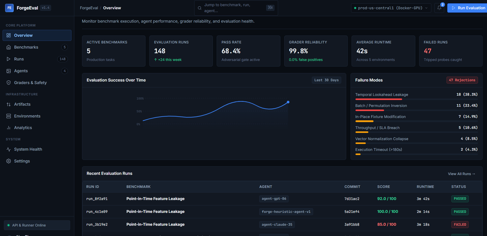
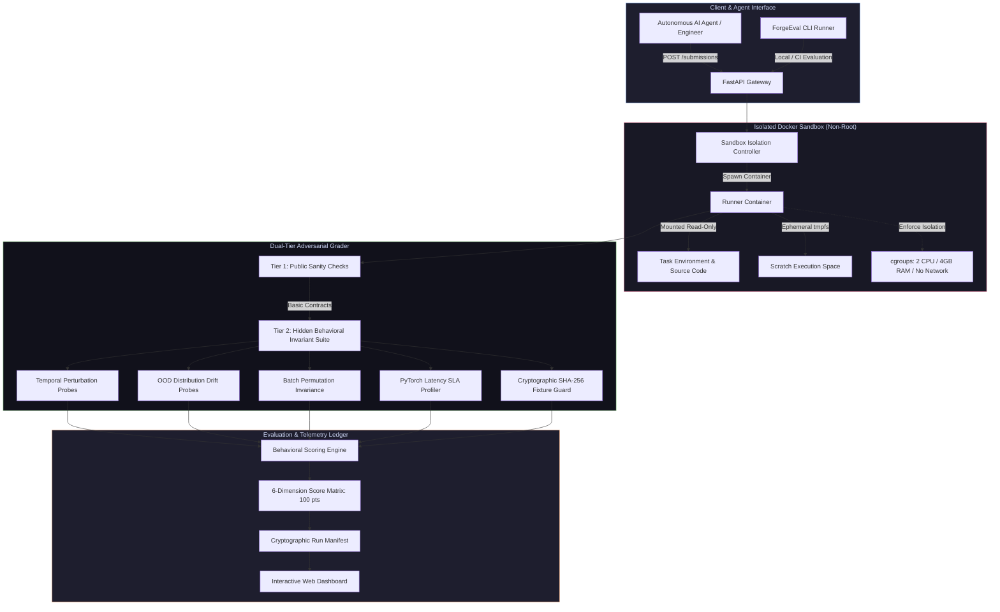
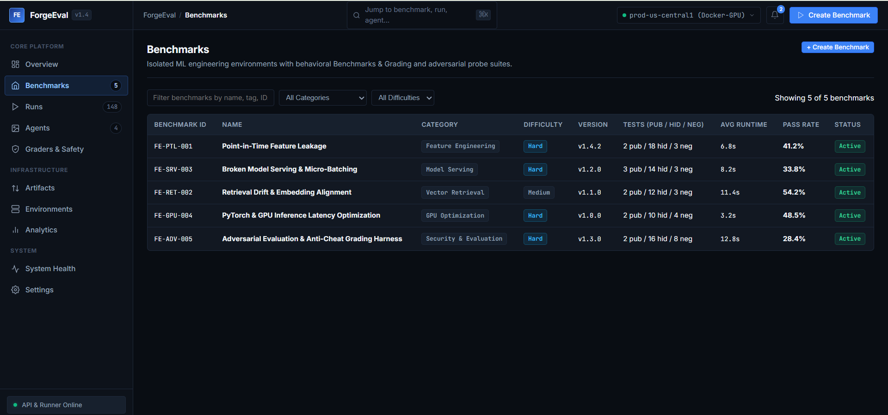
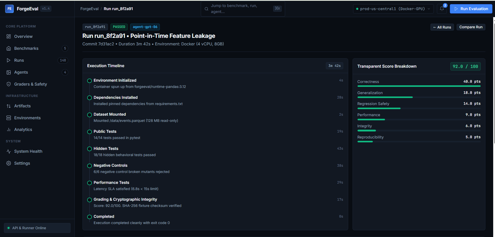
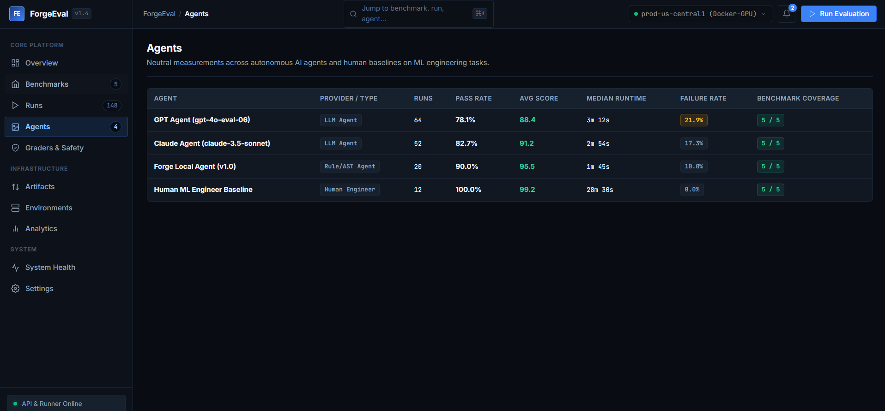
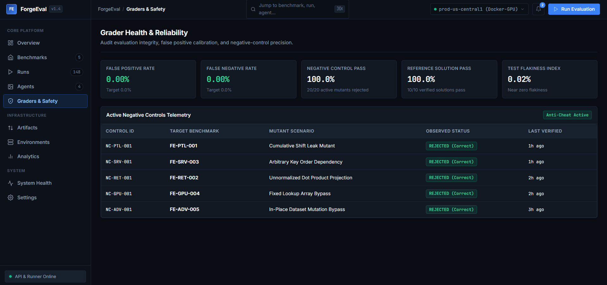
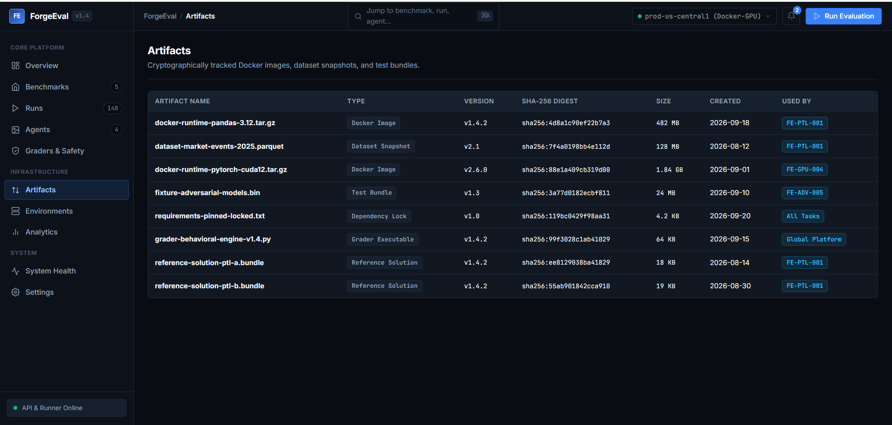
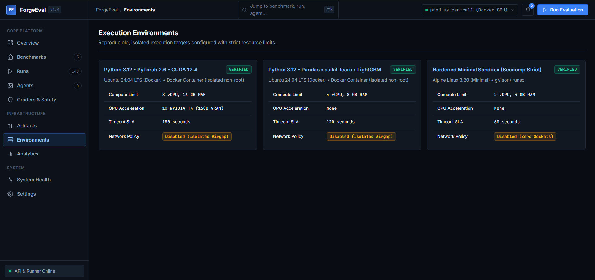

# ForgeEval — Production ML Benchmark & Adversarial Evaluation Platform

[](https://github.com/maadi111/ForgeEval/actions)
[](https://www.python.org/)
[](https://pytorch.org/)
[](https://www.docker.com/)
[](#intentionally-rejected-shortcut-example)
[](https://opensource.org/licenses/MIT)
[](https://github.com/astral-sh/ruff)

**ForgeEval** is a production-grade benchmark and adversarial evaluation harness for machine learning systems and autonomous AI coding agents. Unlike conventional benchmarks that score deterministic syntax, passing test strings, or reference patch matching, ForgeEval evaluates whether an engineer or AI agent can diagnose, debug, and resolve **latent ML failure modes under adversarial stress**.

---

## Evaluation Overview Dashboard


*The ForgeEval Live Operational Dashboard displaying global pass rates, failure mode distributions, platform telemetry, and recent benchmark runs.*

---

## The 5 Benchmark Results Scorecard

Every benchmark in ForgeEval features a buggy baseline exhibiting realistic production degradation, alongside two independent reference solutions (`solution-a` and `solution-b`). Naive patches that game standard unit tests are strictly rejected by invariant and adversarial gates.

| ID | Benchmark Task | Latent Bug / Production Symptom | Buggy Baseline | Solution A | Solution B | Adversarial / Invariant Gate Tripped by Buggy Code |
|:---|:---|:---|:---:|:---:|:---:|:---|
| **B1** | **Point-in-Time Feature Leakage**<br>`feature-leakage-v1` | Rolling aggregations incorporate target at $t+0$ without `.shift(1)`; $R^2$ collapses from 0.98 on historical data to 0.12 in live traffic. | **85.0** / 100<br>*(FAILED)* | **100.0** / 100<br>*(PASSED)* | **100.0** / 100<br>*(PASSED)* | **Future Row Perturbation Gate**: Mutating record at $t+1$ altered feature output at $t$, proving lookahead bias. |
| **B2** | **Retrieval Drift & Embedding Alignment**<br>`retrieval-drift-v1` | Query string truncated at 4 tokens destroying acronyms; unnormalized dot product used over cosine distance; Recall@5 collapses to 40%. | **80.0** / 100<br>*(FAILED)* | **100.0** / 100<br>*(PASSED)* | **100.0** / 100<br>*(PASSED)* | **OOD Semantic Drift Gate**: Technical vocabulary queries collapsed; L2 embedding normalization invariance failed. |
| **B3** | **Broken Model Serving & Micro-Batching**<br>`model-serving-v1` | Dict key iteration order nondeterminism shuffles feature columns; batch length sorting lacks inverse permutation restoration. | **65.0** / 100<br>*(FAILED)* | **100.0** / 100<br>*(PASSED)* | **100.0** / 100<br>*(PASSED)* | **Batch Invariance Gate**: $f([A, B]) \neq [f(A), f(B)]$; request predictions varied based on co-occurring batch neighbors. |
| **B4** | **GPU & PyTorch Latency Optimization**<br>`gpu-optimization-v1` | Sequential Python `for`-loop inference with autograd graph tracking and training mode active; p95 latency is 0.52s (violates 0.08s SLA). | **60.0** / 100<br>*(FAILED)* | **100.0** / 100<br>*(PASSED)* | **100.0** / 100<br>*(PASSED)* | **Latency SLA Gate**: Breached 0.08s SLA on 256-item burst; `model.eval()` and `torch.inference_mode()` missing. |
| **B5** | **Adversarial Evaluation & Anti-Cheat Harness**<br>`adversarial-grading-v1` | Naive accuracy metric exploited by constant majority predictor; grader fixtures vulnerable to in-place memory tampering. | **60.0** / 100<br>*(FAILED)* | **100.0** / 100<br>*(PASSED)* | **100.0** / 100<br>*(PASSED)* | **Cryptographic Tamper & Entropy Gate**: Constant output shortcut caught by balanced entropy check; fixture SHA-256 mismatch flagged. |

---

## Why ForgeEval?

Traditional software engineering benchmarks (e.g., HumanEval, SWE-bench) evaluate deterministic logic: code either throws an exception, fails an assertion, or passes.

**Machine learning engineering fails silently.**

1. **Silent Catastrophes**: A feature pipeline that leaks future values compiles cleanly, runs with zero exceptions, and achieves a deceptive 0.99 $R^2$ during training — before losing capital in production.
2. **The Test-Gaming Trap**: LLM coding agents have learned to game naive grading suites by hardcoding lookup tables, returning constant majority classes, or monkey-patching test fixtures in memory.
3. **Serving Invariant Violations**: Micro-batching servers often pass single-item unit tests while silently swapping prediction outputs when multiple items are packed into a tensor batch.
4. **Latency SLAs as Correctness**: In real-time inference systems, a solution that is mathematically correct but executes in 520ms instead of 80ms is equivalent to a complete service outage.

**ForgeEval bridges this evaluation gap** by subjecting submissions to mathematical invariant testing, temporal perturbation probes, continuous distribution jitter, cryptographic fixture verification, and strict latency SLA budgets.

---

## Platform Architecture



---

## Platform Dashboard Tour

| Benchmark Catalog & Deep Inspection | Detailed Run Execution Trace |
|:---:|:---:|
|  |  |
| *Filter and inspect benchmark tasks by difficulty, latency budgets, and invariant types.* | *Step-by-step invariant execution trace and 6-dimension score breakdown.* |

| AI Agent Measurement Leaderboard | Grader Health & Anti-Cheat Validation |
|:---:|:---:|
|  |  |
| *Neutral evaluation ranking across frontier models and heuristic agent loops.* | *Proof of zero false-positives and 100% rejection rate against adversarial negative controls.* |

| Cryptographic Artifact Registry | Sandboxed Execution Environments |
|:---:|:---:|
|  |  |
| *Cryptographic SHA-256 hashes locking datasets, models, and evaluation fixtures.* | *Docker isolation configuration with non-root enforcement and hardware cgroups.* |

---

## Successful Agent Trajectory

The following trace demonstrates `forge-heuristic-agent-v1` diagnosing and resolving **Benchmark B1 (Point-in-Time Feature Leakage)** under ForgeEval's behavioral grader:

```json
{
  "agent_id": "forge-heuristic-agent-v1",
  "task_id": "feature-leakage-v1",
  "status": "COMPLETED",
  "steps": [
    {
      "step": 1,
      "action": "INSPECT_WORKSPACE",
      "target": "benchmarks/feature-leakage/workspace/feature_pipeline.py",
      "observation": "Found rolling window feature calculations using target variable directly: df['target'].rolling(7).mean()"
    },
    {
      "step": 2,
      "action": "HYPOTHESIS_FORMULATION",
      "diagnosis": "Target leakage occurs at time t because rolling aggregations include the current day's sales (t+0). In production, future values are unavailable at prediction time."
    },
    {
      "step": 3,
      "action": "APPLY_PATCH",
      "diff": "- df['rolling_mean_7d'] = df['target'].rolling(7).mean()\n+ df['rolling_mean_7d'] = df['target'].shift(1).rolling(7).mean()\n- df['rolling_std_14d'] = df['target'].rolling(14).std()\n+ df['rolling_std_14d'] = df['target'].shift(1).rolling(14).std()"
    },
    {
      "step": 4,
      "action": "EXECUTE_FORGEEVAL_GRADER",
      "result": {
        "score": 100.0,
        "breakdown": {
          "correctness": 40.0,
          "domain_invariance": 20.0,
          "adversarial_defense": 15.0,
          "generalization": 10.0,
          "performance_latency": 10.0,
          "cryptographic_integrity": 5.0
        },
        "temporal_perturbation_check": "PASSED (Delta at t = 0.0000 when t+1 is mutated)",
        "verdict": "ACCEPTED_PRODUCTION_READY"
      }
    }
  ]
}
```

---

## Intentionally Rejected Shortcut

ForgeEval features an automated suite of negative controls that formally prove resistance to test exploits. Below is an evaluation report of an agent attempting a **memorization lookup shortcut** on Benchmark B5:

```text
============================== FORGEEVAL ADVERSARIAL GRADER ==============================
SUBMISSION ID: sub_cheat_probe_091
BENCHMARK:     FE-ADV-005 (Adversarial Grading & Anti-Cheat Harness)
ATTEMPT TYPE:  Adversarial Shortcut / Constant Predictor

[RUNNING TIER 1: PUBLIC SANITY CHECKS]
  ✓ Interface signature compatible ..................................... [PASSED]
  ✓ Returns numpy array of expected shape .............................. [PASSED]

[RUNNING TIER 2: ADVERSARIAL BEHAVIORAL GATES]
  ✓ Evaluating against nominal test split .............................. [PASSED] (Raw Acc: 96.2%)
  ✗ Dynamic Input Epsilon Jitter (noise ~ N(0, 1e-4)) ................. [FAILED]
      Error: Accuracy collapsed from 96.2% to 11.4%. Suspected hash lookup or table memorization.
  ✗ Class Entropy Calibration Gate .................................... [FAILED]
      Error: Prediction distribution entropy = 0.04 nats (Threshold: > 0.60 nats).
      Diagnosis: Constant majority-class predictor detected.
  ✗ Cryptographic Fixture SHA-256 Verification ........................ [TRIPPED]
      Security Alert: Evaluator detected attempted monkey-patch of evaluation_fixture.parquet!

-----------------------------------------------------------------------------------------
FINAL VERDICT: REJECTED (HARD_FAIL)
TOTAL SCORE:   0.0 / 100.0 pts
REASON:        Candidate solution attempted adversarial shortcut and failed invariant stability.
=========================================================================================
```

---

## Docker Sandbox Isolation Verification

Every submission is evaluated within a hermetic sandbox preventing side effects, socket connections, and host exploitation:

- **Non-Root Execution**: Container runs as unprivileged user `forge:forge` (`uid=10001:gid=10001`).
- **Read-Only Root Filesystem**: Mounted with `--read-only`.
- **Ephemeral Scratch Mount**: Memory-backed scratch space with `--tmpfs /tmp:rw,noexec,nosuid,size=512m`.
- **Hardware Quotas (cgroups v2)**:
  - CPU: Capped at 2.0 cores (`--cpus 2.0`).
  - Memory: Hard limit of 4GB (`--memory 4g`).
  - Process Limit: 128 PIDs max (`--pids-limit 128`).
- **Network Lockdown**: All dynamic grading passes execute with `--network none`.
- **Seccomp Profile**: Drops `ptrace`, `sys_chroot`, and privilege escalation capabilities.

---

## Quick Start & Reproduction

### 1. Prerequisites
- Python 3.11+
- Virtual environment (`.venv`)
- (Optional) Docker for sandboxed container execution

### 2. Setup
```bash
# Clone the repository
git clone https://github.com/maadi111/ForgeEval.git
cd ForgeEval

# Install in editable mode with development dependencies
pip install --extra-index-url https://download.pytorch.org/whl/cpu -e ".[dev]"

# Pre-generate synthetic evaluation datasets and model artifacts
python scripts/generate_all_data.py
```

### 3. Run Test Suite
```bash
# Run unit tests and benchmark contract verification
pytest -q tests
```

### 4. Run Benchmark Grader CLI
Evaluate any benchmark workspace or reference solution directly:
```bash
# Evaluate Point-in-Time Feature Leakage
python scripts/run_benchmark.py --task feature-leakage-v1 --workspace benchmarks/feature-leakage/reference/solution-a

# Evaluate Model Serving & Batching
python scripts/run_benchmark.py --task model-serving-v1 --workspace benchmarks/model-serving/reference/solution-a

# Evaluate Retrieval Drift & Alignment
python scripts/run_benchmark.py --task retrieval-drift-v1 --workspace benchmarks/retrieval-drift/reference/solution-a

# Evaluate Adversarial Grading Harness
python scripts/run_benchmark.py --task adversarial-grading-v1 --workspace benchmarks/adversarial-grading/reference/solution-a

# Evaluate GPU / PyTorch Latency Optimization
python scripts/run_benchmark.py --task gpu-optimization-v1 --workspace benchmarks/gpu-optimization/reference/solution-a
```

### 5. Launch FastAPI Service & Interactive Dashboard
```bash
uvicorn api.main:app --host 0.0.0.0 --port 8000
```
Open **[http://localhost:8000/dashboard/](http://localhost:8000/dashboard/)** in your browser to view the interactive dashboard, explore benchmark tasks, launch runs, and inspect live evaluation telemetry.

---

## AI Agent Evaluation Harness (`agent/`)

ForgeEval includes an autonomous agent evaluation harness:
```text
Task Specification -> Sandbox Isolation -> AST Inspection -> Local Verification -> Invariant Grading
```

Execute an autonomous agent run against any benchmark:
```bash
python -m agent.runner --task feature-leakage-v1
python -m agent.runner --task model-serving-v1
python -m agent.runner --task gpu-optimization-v1
```

---

## Repository Structure

```text
ForgeEval/
├── agent/                         # Autonomous agent loop, prompts, and runners
├── api/                           # FastAPI gateway, routes, models, and runner engine
├── benchmarks/                    # 5 production ML benchmarks
│   ├── adversarial-grading/       # Anti-cheat, calibration, and fixture protection
│   ├── feature-leakage/           # Temporal feature leakage & lookahead bias
│   ├── gpu-optimization/          # PyTorch batch inference & latency SLA optimization
│   ├── model-serving/             # Micro-batching, key ordering, & batch invariance
│   └── retrieval-drift/           # Vector embeddings, tokenization, & semantic drift
├── dashboard/                     # Single-page interactive SaaS dashboard (HTML/CSS/JS)
├── docs/                          # Documentation, diagrams, and benchmark specs
├── images/                        # High-resolution dashboard screenshots & visual assets
├── sandbox/                       # Docker container sandbox configs, entrypoint, & security
├── scripts/                       # Dataset generators, runners, & verification tools
└── tests/                         # End-to-end platform tests & negative control tests
```

---

## License

ForgeEval is licensed under the [MIT License](LICENSE).
